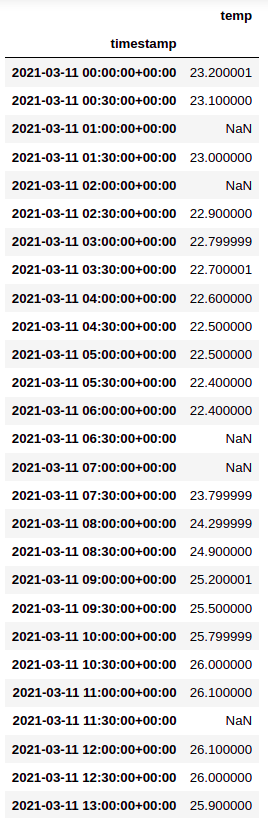
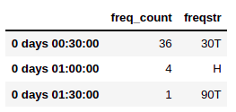
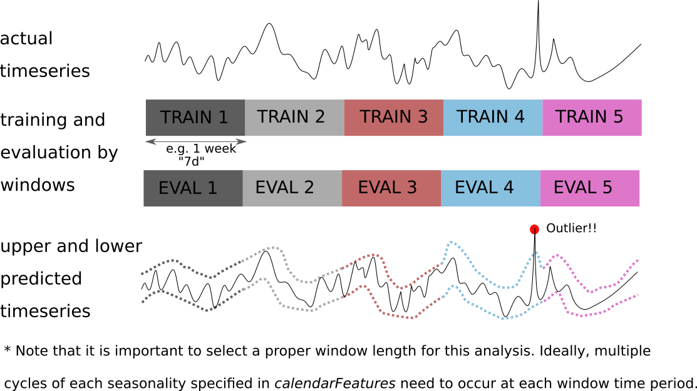

[Return to home](README.md)

### Implementations of the functions
- [biggpy](https://github.com/BeeGroup-cimne/biggpy#readme)
- [biggr](https://github.com/BeeGroup-cimne/biggr#readme)

# :card_file_box: Data Preparation / Time Stamps Alignment

## :round_pushpin: detect_time_step

### Description:
    
The function infers, i.e. automatically deduce from the input data, the minimum time step (frequency) that can be used
for the input time series.

### Input arguments:
* _data_: <code>timeSeries</code>. Input time series whose time step has to be detected.

### Return values: 
* _timeStep_: <code>string</code>. A string in ISO 8601 format representing the time step (e.g. "15T","1H", "3M", "1D"
,...). If the input time series is non-uniform, this will be the (minimum) most frequent time step detected. None If no
frequency can be detected.
* _frequencies_: <code>DataFrame</code>. This will be None if the input time series is uniform otherwise will be a
DataFrame showing all the frequencies detected in the series in descending order and their count.

### Details:
The function takes as input a time-indexed series and optionally the type of the input series and returns the time step
that can be associated with it, represented with a string alias formatted according to the ISO 8601.
For example, some supported string frequency aliases are:

|Alias|Description|
|:----------:|:-------------:|
|S|secondly frequency|
|T, min|minutely frequency|
|H|hourly frequency|
|D|daily frequency|
|W|weekly frequency|
|MS|month start frequency|
|M|month end frequency|
|AS, YS|year start frequency|
|A, Y|year end frequency|

The function will take into account two different cases: uniform time series and non-uniform time series, i.e. a
sequence of observations, where the spacing of observation times is not constant.
If the frequency is not uniform, because of missing values for example, the function will still try to infer the 
frequency, calculating the time deltas between consecutive observations, and return the best guess, 
i.e. the most frequent time step. In case there are two most frequent time steps, the function will return the 
minimum between the two.
The function handles explicit missing values, i.e. samples having NaN as value or implicit missing values, i.e.
samples that are missing in the series given a detected minimum frequency. 

### Examples 
Non-uniform time series of temperatures:

The result will be a <code>tuple</code> containing two values, the detected _timeStep_='30T' and a DataFrame:

## :round_pushpin: align_time_grid

### Description:
    
The function aligns the frequency of the input time series with the output frequency given as an argument using the 
specified aggregation function. 
### Input arguments:
* _data_: <code>timeSeries</code>. The time series that has to be aligned with an output time step,
i.e. with a specific frequency. If the _measurementReadingType_ of the series is not _instantaneous_, the data must 
be converted first using the function _clean_ts_integrate_.
* _outputTimeStep_: <code>string</code>. The frequency used to resample the input time series for the alignment.
It must be a string in ISO 8601 format representing the time step (e.g. "15T","1H", "M", "D",...).
* _aggregationFunction_: <code>string</code>. The aggregation function to use when resampling the series. Possible
values are:
  * _avg_: average value in a time period.
  * _sum_: sum of the values in a time period.
  * _min_: minimum value in a time period.
  * _max_: maximum value in a time period.
  * _median_: median value in a time period.

### Return values: 
* _data_: <code>timeSeries</code>. The time series resampled with the specified period and aggregation function.

### Details:
The function takes as input a time-indexed series with an output time step (frequency) and an aggregation function
and returns a downsampled series using the specified arguments. This function must be used only after the time series is
converted to the _instantaneous_ type of measurement with the function _clean_ts_integrate_. 

## :round_pushpin: clean_ts_integrate

### Description:
    
The function converts a _cumulative_ (counter) or _onChange_ (delta) measurement to _instantaneous_.
### Input arguments:
* _data_: <code>timeSeries</code>. The cumulative or on-change time series that has to be converted to instantaneous.
An _instantaneous_ measurement is a gauge metric, in which the value can increase or decrease and measures a specific
instant in time.
* _measurementReadingType_: <code>enumeration</code>. An argument used to define the measurement reading type. 
Possible values:
  * _onChange_: representing a delta metric, in which the value measures the change since it was last recorded.
  * _cumulative_: representing a cumulative metric, in which the value can only increase over time or be reset to zero
on restart.

### Return values: 
* _data_: <code>timeSeries</code>. The _cumulative_ or _onChange_ time series with the measurements converted to the 
_instantaneous_ type.

### Details:
The function takes as input a time-indexed series with measurements of type _cumulative_ or _onChange_ and returns a 
time series converted to the _instantaneous_ type. The input time series is transformed to an _instantaneous_ metric
based on the _measurementReadingType_. For example, if the _measurementReadingType_ is _cumulative_, the counter 
rollover (reset) must be taken into account in the transformation process.

# :card_file_box: Data Preparation / Outlier Detection

## :round_pushpin: detect_ts_min_max_outliers

### Description:
Detect elements of the time series outside a minimum and maximum range.
 
### Input arguments:
* _data_: <code>timeSeries</code> An argument containing the time series from which the outliers need to be detected.
* _min_: <code>float</code> The minimum value allowed for each element of the time series.
* _max_: <code>float</code> The maximum value allowed for each element of the time series.
* _minSeries_: <code>timeSeries</code>. An optional argument defining a time series with minimum allowed values.
* _maxSeries_: <code>timeSeries</code>. An optional argument defining a time series with maximum allowed values.

### Return value: 
* _outliers_: <code>boolean timeSeries</code> object using the original time period and frequency, only assigning True values when an element should be considered as an outlier.

### Details:
This function detects elements of a time series outside the allowed range in which you know the data should be. In the case of energy consumption, it should be a positive value and not exceeding the total capacity permitted. Sometimes, this value is not easy to define.

Additionally, with the minSeries and maxSeries arguments, this ranges can be set differently along the period. When using this feature, the time step of both _minSeries_ and _maxSeries_ need to be resampled to the original frequency of the _data_ time series, applying forward fill if is needed (Remember the time stamps of each time series element always represent the begining of the time step).

## :round_pushpin: detect_ts_zscore_outliers

### Description:
Detect elements of the time series out of a Z-score threshold, applied on the whole time series or a rolling window of predefined width.

### Input arguments:
* _data_: <code>timeSeries</code> An argument containing the time series from which the outliers need to be detected.
* _zScoreThreshold_: <code>float</code> An argument defining the threshold of the Z-score calculation. 
* _window_: <code>string</code>. A string in ISO 8601 format representing the window (e.g. "7D","1D", "72H"
,...). This is an optional argument setting the width of the rolling window where the Z-normalization calculation is considered. This argument allows to adapt the outlier filtering depending the dynamics of the signal itself. Default value is "NULL", thus no rolling window is considered.
* _zScoreExtremesSensitive_: <code>boolean</code> An optional argument to define if the aggregation function of the Zscore is the mean (true), or median(false). The first one makes the Z-score sensitive to extreme values, and the second no.  Default is true.

### Return value: 
* _outliers_: <code>boolean timeSeries</code> object using the original time period and frequency, only assigning true values when an element should be considered as an outlier.

### Details:
This function uses _detect_time_step()_ to detect the time step of the input time series (_data_) and then calculate the Z-score considering the formula  applied to the choosen _window_. The formula can be  if _zScoreExtremesSensitive_ is set to false.

## :round_pushpin: detect_ts_calendar_model_outliers

### Description:
Detect elements of the time series out of a confidence threshold based on linear model of the calendar variables (month, weekday, hour).

### Input arguments:
* _data_: <code>timeSeries</code> An argument containing the time series from which the outliers need to be detected.
* _calendarFeatures_: <code>list of strings</code> An optional argument set the calendar features of the model. Default values are: ["HOL*intercept","H"]. Possible values are:
  * _intercept_: intercept
  * _Y_: yearly seasonality
  * _m_: monthly seasonality
  * _W_: week of the year seasonality
  * _U_: day of the week seasonality
  * _H_: hour of the day seasonality
  * _HOL_: holidays

* _mode_: <code>string</code> An optional argument setting which outliers need to be filtered, the ones upper, or the ones lower to the prediction. Default is "upperAndLower". Possible values are:
  * _upper_: filter only upper outliers.
  * _lower_: filter only lower outliers.
  * _upperAndLower_: filter upper and lower outliers.
* _upperModelPercentile_: <code>float</code> An optional argument defining the percentile used in the quantile regression model for the upper prediction. Default is 90.
* _lowerModelPercentile_: <code>float</code> An optional argument defining the percentile used in the quantile regression model for the lower prediction. Default is 10.
* _upperPercentualThreshold_: <code>float</code> It sets the dynamic upper threshold to detect outliers. It is an optional argument to define the percentage of difference added to the upper model predition itself. Default is 30. Formula:  
* _lowerPercentualThreshold_: <code>float</code> It sets the dynamic lower threshold to detect outliers. An optional argument to define the percentage of difference substracted to the predition of the model. () Default is 30. Formula:  
* _holidaysCalendar_: <code>list of dates</code> An optional list giving the dates where local or national holidays related to the location of the _data_ argument. Default is empty list.
* _window_: <code>string</code>. A string in ISO 8601 format representing the window (e.g. "2m","4m","14D",...). This is an optional argument setting the width of the window where the model is trained and evaluated. In this case, is more recommended to select a large window that is affected by several cycles of each of the seasonalities considered. This window allows to adapt the outlier filtering depending the dynamics of the signal itself. Nevertheless, instead of a rolling window advancing at each time step, the advances should be the whole length of the window, more information is provided in the details section. By default, the whole time period is considered.

### Return value: 
* _outliers_: <code>boolean timeSeries</code> object using the original time period and frequency, only assigning true values when an element should be considered as an outlier.
* _predicted_: <code>timeSeries</code> of the predicted values of the original timeSeries based on the calendar regression model.

### Details:
This function estimates the outliers of a time series based on a quantile regression model that uses calendar features as input variables. This calendar features, that normally corresponds to common seasonalities, are transformed using Fourier components. However, there are two exceptions of model features that are not transformed using this technique: the _intercept_, which is a fixed term during all the period, and _HOL_ (holidays) feature, which is a 0-1 depending if the day is holiday or not. 

Regarding mandatory features, the _intercept_ is the only one that will be considered even if it is not specified in the _calendarFeatures_ argument. Another interesting point of this argument, is that it allows the interaction between terms. Thus, if we set a _HOL*intercept_ term, a different intercept will be estimated for holidays and non-holidays.

Next figure explains the model evaluation and prediction of the outliers thresholds when a _window_ is configured.
 

## :round_pushpin: plot_outliers

### Description:
v2

### Input arguments:
Time series, outliers logical time series, cleaned time series, showPlot

### Return value: 
This function returns a plot (svg, pdf, html)

### Details:
Plot the data cleaning process of a time series to expose the outliers

## :round_pushpin: detect_static_min_max_outliers

### Description:
Detect which numerical elements are outside the min-max range.

### Input arguments:
* _data_: <code>float/integer list</code> The numerical elements to be evaluated
* _min_: <code>float/integer</code> The minimum value of the range.
* _max_: <code>float/integer</code> The maximum value of the range.
* _includedMin_: <code>boolean</code> An optional argument setting if the minimum value should be included as valid value (true), or not (false). Default is true.
* _includedMax_: <code>boolean</code> An optional argument setting if the maximum value should be included as valid value (true), or not (false). Default is true.

### Return value: 
* _outliers_: <code>boolean list</code> considering if each element of the _data_ list is an outlier, or not. 

### Details:
This function should be used to filter outliers of static data (e.g. building areas, year of construction, ...)

## :round_pushpin: detect_static_reg_exp

### Description:
Detect which string element satisfy the regular expression

### Input arguments:
* _data_: <code>string list</code> The elements to be evaluated.
* _regExpValues_: <code>string list</code> A list of regular expressions to be checked.
* _negativeExp_: <code>boolean</code> An optional argument to evaluate the inverse result of the regular expressions. Default is false, thus all elements that are satified by any of the regular expressions are true.

### Return value: 
* _outliers_: <code>boolean list</code> considering if each element of the _data_ list satisfy any of the regular expression, or the contrary (if _negativeExp_ is true).

### Details:
To test regular expressions configured in the _regExpValues_ you should use the application https://regexr.com/

# :card_file_box: Data Preparation / Missing Data Management

## :round_pushpin: fill_ts_na

### Description:
This function imputates values to Not Available (NA) elements of a time series, based on the outliers estimation made the functions implemented in Outlier Detection module block of this library.

### Input arguments:
* _data_: <code>timeSeries</code> with Not Available elements to be filled.
* _outliersMinMax_: <code>detect_ts_min_max_outliers() _output_</code>
* _outliersZScore_: <code>detect_ts_zscore_outliers() _output_</code> 
* _outliersCalendarModel_: <code>detect_ts_calendar_model_outliers() _output_</code> 
* _methodFillNA_: <code>string</code> argument specifying the methodology for filling the NA elements. Possible values are:
  * _calendarModel_: The predicted values estimated by the calendar model are used to fulfill the NA elements.
  * _backward_: The previous known element of the time series is considered.
  * _forward_: The next known element of the time series is considered.
  * _linearInterpolation_: A linear interpolation is done between using previous and next known elements regarding each data gap.
* _maxGap_: <code>string</code> in ISO 8601 format representing the window (e.g. "4H", "30M", "72H", "2D",...). It defines the maximum period allowed. Therefore, gaps with greater period are not considered in the imputation. By default, it doesn't exists a limitation of the gap longitude.
* _fillMask_: <code>boolean timeSeries</code> defining the time periods where the imputation can be done. By default, all elements of the time series can be filled.

### Return value: 
* _filledData_: <code>timeSeries</code> with filled elements.

### Details:
This function requires the previous usage of the Outlier Detection functions. An interpretation of the _maxGap_ and a resample of the _fillMask_ time step is done, considering the actual time step of the _data_ time series. Actual methods to fill the NA elements are quite simple, but in future more complex implementation of this imputation could be integrated. 

