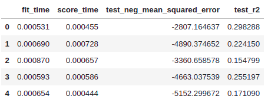
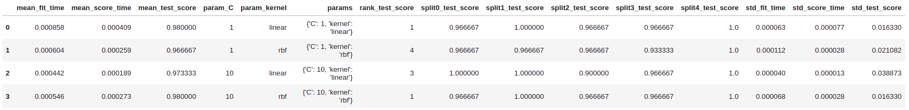

[Return to home](README.md)

### Implementations of the functions
- [biggpy](https://github.com/BeeGroup-cimne/biggpy#readme)
- [biggr](https://github.com/BeeGroup-cimne/biggr#readme)

# :card_file_box: Data Modelling / Cross Validation

## :round_pushpin: k_fold_data_partitioning

### Description:
    
The function divides all the samples in _k_ groups of samples, called folds (if _k_ is chosen to be equal to the size of
the input dataset _n_, this is equivalent to the _Leave One Out_ strategy, where n-1 observations are used for the 
training set and the remaining one is used for the test set), of approximately equal sizes. 
The prediction function is learned using _k-1_ folds, and the fold left out is used for test.

### Input arguments:
* _data_: <code>timeSeries</code>. Input time series representing the dataset to partition.
* _k_: <code>int</code>. Number of folds. Must be at least 1. If it is 1, only one split between training and 
 test set will be created (train-test split case). The default value is 5.
* _training_set_size_: <code>int</code>. Number representing the size of the training set, expressed in percentage of the
entire dataset size. This argument will be ignored if the number of folds is greater than one.
* _random_split_: <code>bool</code>. Shuffle the data before splitting to create folds with datapoints in random order.
 The default value is False.
* _seed_: <code>int</code>. If _random_split_ is False, this argument is ignored.
If _random_split_ is True, the seed specifies a random number generator seeded by the given integer and will produce
 the same results across different calls. If _seed_ is None (default), the function uses a standard random state 
instance (e.g., from numpy.random in Python) and produce different results across different calls.

### Return values: 
* _partition_indices_: <code>Generator</code>. Yields (generate) couples of _k_ training sets and test sets indices, 
each couple representing one split.

### Details:
This function is often used when tuning the hyper-parameters of a model to select the best parameter set or in general
when evaluating the performance of a model with chosen hyper-parameter. 
If the dataset is not divisible in fold of the exact same size, the first n_samples % n_splits folds have size 
n_samples // n_splits + 1, other folds have size n_samples // n_splits, where n_samples is the number of samples.
However, this function can still be used to obtain just one split of the dataset into training set and test set with
_k=1_. In this case the proportion of training set and test set can be specified with the arg _training_set_size_.
The train-test split case is treated by this function as a special case of _k_fold_data_partitioning_.
For time series it is suggested to use the other partitioning method of the library _time_series_data_partitioning_ to 
preserve the temporal relationship between observations.

## :round_pushpin: time_series_data_partitioning

### Description:
    
This is a time-aware variation of k-fold which returns first _k_ folds as train set and the _k-1_ th fold as test set. 
Note that unlike standard cross-validation methods, successive training sets are supersets of those that come before 
them. Also, it adds all surplus data to the first training partition, which is always used to train the model.

### Input arguments:
* _data_: <code>timeSeries</code>. Input time series representing the dataset to partition.
* _k_: <code>int</code>. Number of folds. Must be at least 2. The default value is 5.
* _max_training_set_size_: <code>int</code>. Maximum size for a single training set.

### Return values: 
* _partition_indices_: <code>Generator</code>. Yields (generate) couples of _k_ training sets and test sets indices, 
each couple representing one split.

### Details:

This function represents a variation of the k-fold base algorithm that also takes into account the temporal dependency 
between the observations in the dataset. When treating time series, we must take into account that it would make no 
sense to use data from the future to forecast what happened in the past. This is the reason why it is suggested to use
a time-aware partitioning method when dealing with time-series. A standard k-fold validation on a time series, 
can generate training sets with observations that occur after the observation of the test set. This way, the model would
be trained on future data to predict past data, which is a situation we want to avoid.
This function will partition the data so that the test sets of each fold will not overlap in time (will contain unique
observations) and observations from the training set will always occur before their corresponding test set.
The return value is a generator that can be used directly as input argument of the _tune_hyper_parameters_ function to 
specify which partitioner to use.

# :card_file_box: Data Modelling / Model Assessment

## :round_pushpin: evaluate_model_cv

### Description:
    
This function evaluates the performances of a given model instance by cross-validation using the given metrics. 

### Input arguments:
* _model_instance_: <code>object</code>. Object representing a specific model instance, i.e. a model class (family) 
 already initialized with a fixed set of hyper-parameters (if available).
* _X_data_: <code>timeSeries</code>. X time series. Training vector of shape (_n_samples_, _n_features_), 
where _n_samples_ is the number of samples and _n_features_ is the number of features.
* _y_data_: <code>timeSeries</code>. Y time series. Target relative to X for classification or regression; 
None for unsupervised learning.
* _scoring_: <code>list</code><code>string</code>. A list of strings representing the scoring functions to use.
* _cv_splitter_: <code>Generator</code>. This parameter is a generator coming from a partitioning function of the 
library which yields couples of _k_ training sets and test sets indices, each couple representing one split.

### Return values:
* _cv_results_: <code>dict</code>. A dict of arrays containing the score/time arrays for each scoring metric.
Can be imported into a DataFrame.

Example:

 

### Details:

This function will evaluate a model instance,  i.e. a model class (family) which has been already initialized with a 
fixed set of hyper-parameters using one or more scoring functions and a cross-validation splitter. 
For each cross validation iteration (split), it will fit the model instance on the folds representing the training set 
and predict on the fold left out as test set, calculating the accuracy of the prediction with the provided scoring 
functions. 
N.B.: To evaluate the generalization performance of several model instances of the same model family (model family
requiring a tuning of their hyper-parameters), _the evaluate_model_with_tuning_ function should be used.

## :round_pushpin: evaluate_model_cv_with_tuning

### Description:
    
This function performs a nested cross-validation (double cross-validation), which includes an internal hyper-parameter 
tuning, to reduce the bias when combining the two tasks of model selection and generalization error estimation. However,
the purpose of this function is not to select the best model instance of a model family but instead to provide a less 
biased estimate of a tuned model’s performance on the dataset.

### Input arguments:
* _model_family_: <code>string</code>. string identifying a model family (e.g. 'SVC',
'DecisionTreeClassifier', etc.)
* _X_data_: <code>timeSeries</code>. X time series. Training vector of shape (_n_samples_, _n_features_), 
where _n_samples_ is the number of samples and _n_features_ is the number of features.
* _y_data_: <code>timeSeries</code>. Y time series. Target relative to X for classification or regression; 
None for unsupervised learning.
* _parameter_grid_: <code>dict</code>. Dictionary containing the set of parameters to explore.
* _scoring_: <code>string</code>. A string representing the scoring function to use.
* _cv_splitter_outer_: <code>Generator</code>. This parameter is a generator coming from a partitioning function of the 
library which yields couples of _k_ training sets and test sets indices, each couple representing one split. This 
splitter is related to the outer loop of cross-validation and generally has a _k_ lower than or equal to the inner.
The default value is 10.
* _cv_splitter_inner_: <code>Generator</code>. This parameter is a generator coming from a partitioning function of the 
library which yields couples of _k_ training sets and test sets indices, each couple representing one split. This 
splitter is related to the inner loop of cross-validation for the hyper-parameter tuning. The default value is 5.

### Return values:
* _mean_score_: <code>float</code>. Mean cross-validated score for all the model instances.
* _mean_std_: <code>float</code>. Standard deviation from the mean score.
* _cv_results_: <code>list</code><code>dict</code>. A list of dictionaries where each element represents the results
obtained on a specific model instance in terms of performance evaluation and selected hyper-parameters. Can be imported
into a DataFrame.

### Details:

This function will evaluate multiple model instances, i.e. several models of the same family instantiated with a 
specific set of hyper-parameters. However, the purpose of this procedure is not the selection of the best model (the 
function _tune_hyper_parameters_ is in charge of this task) among all the instances but is instead to provide a 
less-biased evaluation of a subset of instances of a model family. The score obtained from the function 
_tune_hyper_parameters_ is not a reasonable estimate of our testing error, when evaluating the performance of the 
best model, and it is shown to be too optimistic in practice. Indeed, in that case, we use the final scores to pick-up
the best model. It means that we used knowledge from the test set (i.e. test score) to decide our model’s 
training parameter and that score is not representative of the generalization performance of the model. 
While, in this case, the hyper-parameter tuning is less likely to overfit the dataset as 
it is only carried out on a subset of the dataset provided by the outer cross-validation procedure. 
This function will run the hyper-parameter tuning for each training set of the outer cross-validation split and 
evaluate the best selected model instance at that iteration using the test set of that split. 
If _k_ is the number of folds or iterations of the outer cross-validation loop, then this function will produce _k_
"surrogate models" each one with a specific hyper-parameter configuration and accuracy score. The statistical assumption
is that the _k_ outer surrogate models will be equivalent to the final model built by the _tune_hyper_parameter_.
The results of each evaluation carried out on the outer cross validation splits are then averaged into one single value
and the surrogate models are discarded.

Example:

 

# :card_file_box: Data Modelling / Model Identification

## :round_pushpin: tune_hyper_parameters

### Description:
    
This function performs an exhaustive search on all the parameters of the parameter grid defined and identifies the best
parameter set for a specific model family, given a scoring function.

### Input arguments:
* _model_family_: <code>string</code>. string identifying a model family (e.g. 'SVC',
'DecisionTreeClassifier', etc.)
* _X_data_: <code>timeSeries</code>. X time series. Training vector of shape (_n_samples_, _n_features_), 
where _n_samples_ is the number of samples and _n_features_ is the number of features.
* _y_data_: <code>timeSeries</code>. Y time series. Target relative to X for classification or regression; 
None for unsupervised learning.
* _parameter_grid_: <code>dict</code>. Dictionary containing the set of parameters to explore.
* _scoring_: <code>string</code>. A string representing the scoring function to use.
* _cv_splitter_: <code>Generator</code>. This parameter is a generator coming from a partitioning function of the 
library which yields couples of _k_ training sets and test sets indices, each couple representing one split.

### Return values: 
* _best_model_instance_: <code>object</code>. Best model instance of the model family found by the exhaustive search and 
retrained on the whole dataset.
* _best_params_: <code>dict</code>. Parameter setting that gave the best results on the hold out data.
* _best_score_: <code>float</code>. Mean cross-validated score of the best model _best_model_instance_.
* _cv_results_: <code>dict</code>. A dict with keys as column headers and values as columns representing the test score
for each split, each parameter combination, the rank of each set of parameters and the mean test score and standard 
deviation. Can be imported into a DataFrame.

Example:

 

### Details:

It will perform an exhaustive search of the best parameters for the given model family over the parameter grid, using
the provided cross validation partitioning. For each fixed combination of hyper-parameters (parameter set) 
and cross validation iteration (split), it will fit the model instance on the folds representing the training set and 
predict on the fold left out as test set, calculating the accuracy of the prediction with the provided scoring function. 
Then, it will compute the average of all the cv split scores for each fixed combination of hyper-parameters. Finally, it
will return the model instance retrained on the whole dataset using the parameters that provided the best mean 
cross-validated score. For details, the function will also provide a dictionary showing the final and intermediate 
results and also the time took for the several phases of the optimization.

## :round_pushpin: identify_best_model

### Description:
    
This function implement a complete generalized pipeline to find the best model among different model families, each one 
associated with a specific parameter grid, given a input time series and a scoring function. 

### Input arguments:
* _X_data_: <code>timeSeries</code>. X time series. Training vector of shape (_n_samples_, _n_features_), 
where _n_samples_ is the number of samples and _n_features_ is the number of features.
* _y_data_: <code>timeSeries</code>. Y time series. Target relative to X for classification or regression; 
None for unsupervised learning.
* _parameter_grid_: <code>dict</code>. Dictionary of key:values pairs, where the key is a string identifying the 
_model_family_ (e.g. 'SVC', 'DecisionTreeClassifier', etc.) and the value is a dictionary identifying the parameter grid
  (subset of parameters to test) for that specific model family.
* _scoring_: <code>string</code>. A string representing the scoring function to use.
* _cv_splitter_outer_: <code>Generator</code>. This parameter is a generator coming from a partitioning function of the 
library which yields couples of _k_ training sets and test sets indices, each couple representing one split. This 
splitter is related to the outer loop of cross-validation and generally has a _k_ lower than or equal to the inner. d
* _cv_splitter_inner_: <code>Generator</code>. This parameter is a generator coming from a partitioning function of the 
library which yields couples of _k_ training sets and test sets indices, each couple representing one split. This 
splitter is related to the inner loop of cross-validation for the hyper-parameter tuning and for the final model tuning 
required by the model selection procedure.

### Return values:
* _best_model_instance_: <code>object</code>. Best model instance of the model families found by the exhaustive search 
and retrained on the whole dataset.
* _best_params_: <code>dict</code>. Dictionary with a key:value pair, where the key identifies the best model family and 
the value the best configuration, i.e. the best set of hyper-parameters.
* _mean_score_: <code>float</code>. Mean score for all the model instances produced by the nested cross validation 
procedure.
* _mean_std_: <code>float</code>. Standard deviation from the mean score.
* _cv_results_final_: <code>dict</code>. A dict with keys as column headers and values as columns representing the 
test score for each split, each parameter combination, the rank of each set of parameters and the mean test score and 
standard deviation. Can be imported into a DataFrame.
* _cv_results_evaluation_: <code>list</code><code>dict</code>. 
A list of dictionaries related to the results of the nested cross-validation procedure. Each element represents the 
results obtained on a specific model instance in terms of performance evaluation and selected hyper-parameters.
Can be imported into a DataFrame.

### Details:

This function implements a full generalized pipeline to select the best model among several model instances of different
model families. First, It will select the best model family for the given dataset (the family giving the best score)
using the same nested cross-validation procedure (_data_modelling_._cross_validation_._evaluate_model_cv_with_tuning_), 
then it will run the _data_modelling_._cross_validation_._tune_hyper_parameters_ function on the best model family with 
the related _parameter_grid_.

# :card_file_box: Data Modelling / Model Persistence and prediction

## :round_pushpin: serialize_model

### Description:
    
This procedure serializes a model, according to the specified file format and saves it on the file system following a 
specific convention (tbd).

### Input arguments:
* _model_dir_path_: <code>string</code>. Full path (not relative) on the file system of the directory where the model
should be saved.
* _format_: <code>string</code>. Format of the model to serialize and persist (tbd by the programming language or 
framework adopted, e.g. mlflow).

### Return values:
None

### Details:

This procedure will save a model created by a pipeline on the file system, so that it can be persisted and then loaded
for future prediction on new _X_data_ using the complementary function _deserialize_and_predict_. The file format for
the serialization and the naming convention to use are specific of the programming language or framework adopted.

## :round_pushpin: deserialize_and_predict

### Description:
    
This function deserializes a model, inferring the file format from the file name, applies the model on the 
_X_data_ and returns the predicted values in the form of a time series.

### Input arguments:
* _model_full_path_: <code>string</code>. Full path (not relative) on the file system of the model to load.
* _X_data_: <code>timeSeries</code>. X time series. Vector of predictors of shape (_n_samples_, _n_features_), 
where _n_samples_ is the number of samples and _n_features_ is the number of features or predictors.

### Return values:
* _y_data_: <code>timeSeries</code>. Y time series. Predicted target values.

### Details:

This function will load a model stored on the file system and specified with a full path (not relative) and predict, 
based on the input _X_data_, the target values. The function will infer the format of the model from its file name and
select automatically the correct loader (see the function _serialize_model_) to deserialize it. The predicted values 
are provided as an output in the form of time series.

## :round_pushpin: test_stationarity_acf_pacf

### Description:
    
This function tests the stationarity and plot the autocorrelation and partial autocorrelation of the time series. 

### Input arguments:
* _data: <code>timeSeries</code> for which the stationarity as to be evaluated.
* _sample: <code>float</code>. Sample of the data that will be evaluated.
* _maxLag: <code>int</code>. Maximum lag which is included in test, default value of 12*(nobs/100)^{1/4} is used when None.

### Return values: 
* <code>plot</code> of the mean and variance of the sample with the p-value.
* <code>plot</code> of the autocorrelation and partial autocorrelation. 

### Details:

This function will test the stationarity by running Augmented Dickey-Fuller test wiht 95%
In statistics, the Dickey–Fuller test tests the null hypothesis that a unit root is present in an autoregressive model. 
    The alternative hypothesis is different depending on which version of the test is used but is usually stationarity or trend-stationarity. 
    - plotting mean and variance of a sample from data
    - plotting autocorrelation and partial autocorrelation
* p-value > 0.05: Fail to reject the null hypothesis (H0), the data has a unit root and is non-stationary.
* p-value <= 0.05: Reject the null hypothesis (H0), the data does not have a unit root and is stationary.

This function is used to verify stationarity so that suitable forecasting methods can be applied. 

Partial autocorrelation is a summary of the relationship between an observation in a time series with observations at prior time steps 
with the relationships of intervening observations removed.
The partial autocorrelation at lag k is the correlation that results after removing the effect of any correlations due to the terms at shorter lags.

The autocorrelation for an observation and an observation at a prior time step is comprised of both the direct correlation and indirect correlations. 
These indirect correlations are a linear function of the correlation of the observation, with observations at intervening time steps.

These correlations are used to define the parameters of the forecasting methods (lag). 

## :round_pushpin: split_train_test

### Description:
    
This function splits the time series into train and test datasets at any given data point. 

### Input arguments:
* _data_: <code>timeSeries</code> we want to split. 
* _test_: <code>float</code> (ex: 0.2) or <code>str</code>: index position (ex."yyyy-mm-dd", 1000). Test size 
* _plot_: <code>bool</code> to decide if the 2 new time series have to be plotted

### Return values: 
* _ts_train_: <code>timeSeries</code>. Train time series
* _ts_test_: <code>timeSeries</code>. Test time series 
* _Optional_<code>plot</code> of the train and test time series 

### Details:

This function takes a dataset and divides it into two subsets: the first one will be used to fit the model and the second one will be the used to evaluate the fit. 

## :round_pushpin: param_tuning_sarimax

### Description:
    
This function performs an exhaustive search on all the parameters of the parameter grid defined and identifies the best parameter set for a sarimax models, given a scoring function.

### Input arguments:
* _data_: <code>timeSeries</code> to which to fit the sarimax estimator. This may either be a Pandas Series object or a numpy array. 
* _Optional_ _m_: <code>int</code>. The period for seasonal differencing, m refers to the number of periods in each season. For example, m is 4 for quarterly data, 12 for monthly data, or 1 for annual (non-seasonal) data. Default is 1. Note that if m == 1 (i.e., is non-seasonal), seasonal will be set to False.
* _information_criterion_: <code>str</code>. The information criterion used to select the best model. Possibilities are ‘aic’, ‘bic’, ‘hqic’, ‘oob’. Default is 'aic'. 
* _Optional_ _max_order_: <code>int</code>. Maximum value of p+q+P+Q. If the sum of p and q is >= max_order, a model will not be fit with those parameters, but will progress to the next combination. Default is 5.

### Return values: 
* _best_model_: <code>Object</code>. Best parameters for the sarimax model found by the exhaustive search. 

### Details:

This function automatically discovers the optimal order for an sarimax model. It seeks to identify the most optimal parameters. 
In order to find the best model, it optimizes for a given information_criterion, one of (‘aic’, ‘aicc’, ‘bic’, ‘hqic’, ‘oob’) and returns the sarimax model which minimizes the value.

## :round_pushpin: param_tuning_prophet

### Description:
    
This function performs a search on all the parameters of the parameter grid defined and identifies the best parameter set for a sarimax models, given a MAPE scoring.

### Input arguments:
* _data_: <code>timeSeries</code> to which to fit the prophet estimator.
* _p_: <code>int</code>. The period that you want to forecast. 
* _Optional_seasonality_mode_: <code>list of strings</code> containing the set of parameters to explore 'multiplicative' and/or 'additive'.
* _Optional_changepoint_prior_scale_: <code>list of floats</code> controling the flexibility of the changepoints.
* _Optional_holidays_prior_scale_: <code>list of floats</code> controling the flexibility of the holidays. 
* _Optional_n_changepoints_: <code>list of int</code> containing the maximum number of trend changepoints allowed when modeling the trend.

### Return values: 
* _optimals_: <code>Object</code>. Best parameters for the prophet model found by the exhaustive search. 

### Details:

This function seeks to identify the most optimal parameters. In order to find the best model, it optimizes for MAPE criterion and returns the prophet model which minimizes the value.

## :round_pushpin: fit_sarimax

### Description:
    
This function trains and fits a SARIMAX model 

### Input arguments:
* _ts_train_: <code>timeSeries</code> used to train the model. 
* _order_: <code>tuple</code>. ARIMA(p,d,q) --> p: lag order (AR), d: 
                  degree of differencing (to remove trend), q: order 
                  of moving average (MA). 
* _seasonal_order_: <code>tuple</code>. (P,D,Q,s) --> s: number of 
                  observations per seasonal (ex. 7 for weekly 
                  seasonality with daily data, 12 for yearly 
                  seasonality with monthly data).              
* _exog_train_: <code>timeSeries</code> containing the exogeneous variables.  

### Return values: 
* _model_: <code>Object</code> holding results from fitting the model. 

### Details:

A seasonal autoregressive integrated moving average (SARIMA) model is one step different from an ARIMA model based on the concept of seasonal trends:

The AR from ARIMA stands for autoregressive and refers to using lagged values of our target variable to make our prediction. For example, we might use today’s, yesterday’s, and the day before yesterday’s sales numbers to forecast tomorrow’s sales. That would be an AR(3) model as it uses 3 lagged values to make its prediction.

The I stands for integrated. It means that instead of taking the raw target values, we are differencing them. For example, our sales prediction model would try to forecast tomorrow’s change in sales (i.e. tomorrow’s sales minus today’s sales) rather than just tomorrow’s sales. The reason we need this is that many time series exhibit a trend, making the raw values non-stationary. Taking the difference makes our Y variable more stationary.

The MA stands for moving average. A moving average model takes the lagged prediction errors as inputs. It’s not a directly observable parameter unlike the others (and it’s not fixed as it changes along with the model’s other parameters). At a high level, feeding the model’s errors back to itself serves to push it somewhat towards the correct value (the actual Y values).

The S in SARIMA stands for seasonality: consistently cyclical and easily predictable, which means that we should look past the cyclicality (in other words adjust for it).

SARIMAX extends on this framework just by adding the capability to handle exogenous variables.
              
              
## :round_pushpin: test_sarimax

### Description:
    
This function gets the prediction of the sarimax model. 

### Input arguments:
* _start_: <code>int</code>, <code>str</code> or <code>datetime</code>. Observation number at which to start forecasting used to train the model. Can also be a date string to parse or a datetime type. Default is the zeroth observation.
* _end_: <code>int</code>, <code>str</code> or <code>datetime</code>. Observation number at which to end forecasting. Default is the last observation in the sample.          
* _exog_test_: <code>timeSeries</code> containing the exogeneous variables.  
* _model_: <code>Object</code> holding results from fitting the model. 

### Return values: 
* _forecast_: <code>timeSeries</code> containing the forecasted value. 

### Details:
This function will make the prediction using the model previously created. 
              

## :round_pushpin: fit_prophet

### Description:
    
This function trains and fits a PROPHET model 

### Input arguments:
* _ts_train_: <code>timeSeries</code>. Imported into a DataFrame with columns 'ds' (dates), 
             'y' (values), 'cap' (capacity if growth="logistic") [requirement of the Prophet model], 
             other additional regressor. 
* _lst_exog_: <code>list</code> of exogeneous variables. 
### Return values: 
* _model_: <code>Object</code> holding results from fitting the model. 

### Details:
Prophet makes use of a decomposable time series model with three main model components: trend, seasonality, and holidays.

They are combined in the following equation:
y(t) = g(t) + s(t) + h(t) + e(t)

g(t): trend models non-periodic changes; linear or logistic.
s(t): seasonality represents periodic changes; i.e. weekly, monthly, yearly.
h(t): ties in effects of holidays; on potentially irregular schedules ≥ 1 day(s).
The error term e(t) represents any idiosyncratic changes which are not accommodated by the model; later we will make the parametric assumption that e(t) is normally distributed.

Similar to a generalized additive model, with time as a regressor, Prophet fits several linear and non-linear functions of time as components.
Prophet is framing the forecasting problem as a curve-fitting exercise rather than looking explicitly at the time based dependence of each observation.
              
## :round_pushpin: test_prophet

### Description:
    
This function gets the prediction of the prophet model. 

### Input arguments:
* _model_: <code>Object</code> holding results from fitting the model. 
* _period_: <code>int</code>. Number of periods to be predicted. 

### Return values: 
* _forecast_: <code>timeSeries</code> containing the forecasted value. 

### Details:
This function will make the prediction using the model previously created. 

## :round_pushpin: evaluate_forecast 

### Description:
    
This function calculates evaluation metrics for the prediction. 

### Input arguments:
* _dtf_: <code>timeSeries</code>. Imported into a DataFrame with columns raw values, fitted training values, predicted test values.  
* _title_: <code>str</code>. Title of the plot. 
* _plot_: <code>bool</code> to visualize on a plot the result. Default is True. 

### Return values: 
* _dtf_eval_: <code>timeSeries</code>. Imported into a DataFrame with raw ts and forecast.
* _plot_ of the real value and the forecast. With it, the value of the metrics. 

### Details:
This function will calculate several metrics (mae, mse, rmse for example) to be able to compare the results of the forecast models. 

## :round_pushpin: schedule_optimizer

### Description:
    
This function gives alternative schedules for households to answer to the flexibility request. 

### Input arguments:
* _X_forecast_: <code>timeSeries</code>. Forecast of X household energy consumption. 
* _flex_request_: <code>tuple</code>. Time window and amount of energy asked in the flexibility request. 
* _X_user_pref_: <code>dict</code> containing the X user preferences.
* _dynamic_tariff_: <code>timeSeries</code>. Price of energy per hour. 
* _dynamic_renew_energy_: <code>timeSeries</code>. Quantity of available renewable energy per hour. 

### Return values: 
* _Y_schedule_: <code>dict</code> A dict containing the alternative schedule for each Y households. 

### Details:
This function will analyze which households have to adapt their consumption to answer to the flexibility request based on the forecast and taking into account their preferences. Alternative schedules are created for these identified households considering the dynamic tariff and the amount of renewable energy available.

