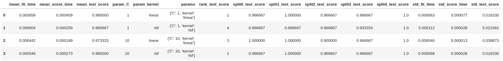

[Return to home](README.md)

### Implementations of the functions
- [biggpy](https://github.com/BeeGroup-cimne/biggpy#readme)
- [biggr](https://github.com/BeeGroup-cimne/biggr#readme)

# :card_file_box: Data Modelling / Cross Validation

## :round_pushpin: k_fold_data_partitioning

### Description:
    
The function divides all the samples in _k_ groups of samples, called folds (if _k_ is chosen to be equal to the size of
the input dataset _n_, this is equivalent to the _Leave One Out_ strategy, where n-1 observations are used for the 
training set and the remaining one is used for the test set), of approximately equal sizes. 
The prediction function is learned using _k-1_ folds, and the fold left out is used for test.

### Input arguments:
* _data_: <code>timeSeries</code>. Input time series representing the dataset to partition.
* _k_: <code>int</code>. Number of folds. Must be at least 1. If it is 1, only one split between training and 
 test set will be created (train-test split case). The default value is 5.
* _training_set_size_: <code>int</code>. Number representing the size of the training set, expressed in percentage of the
entire dataset size. This argument will be ignored if the number of folds is greater than one.
* _random_split_: <code>bool</code>. Shuffle the data before splitting to create folds with datapoints in random order.
 The default value is False.
* _seed_: <code>int</code>. If _random_split_ is False, this argument is ignored.
If _random_split_ is True, the seed specifies a random number generator seeded by the given integer and will produce
 the same results across different calls. If _seed_ is None (default), the function uses a standard random state 
instance (e.g., from numpy.random in Python) and produce different results across different calls.

### Return values: 
* _partition_indices_: <code>Generator</code>. Yields (generate) couples of _k_ training sets and test sets indices, 
each couple representing one split.

### Details:
This function is often used when tuning the hyper-parameters of a model to select the best parameter set or in general
when evaluating the performance of a model with chosen hyper-parameter. 
If the dataset is not divisible in fold of the exact same size, the first n_samples % n_splits folds have size 
n_samples // n_splits + 1, other folds have size n_samples // n_splits, where n_samples is the number of samples.
However, this function can still be used to obtain just one split of the dataset into training set and test set with
_k=1_. In this case the proportion of training set and test set can be specified with the arg _training_set_size_.
The train-test split case is treated by this function as a special case of _k_fold_data_partitioning_.
For time series it is suggested to use the other partitioning method of the library _time_series_data_partitioning_ to 
preserve the temporal relationship between observations.

## :round_pushpin: time_series_data_partitioning

### Description:
    
This is a time-aware variation of k-fold which returns first _k_ folds as train set and the _k-1_ th fold as test set. 
Note that unlike standard cross-validation methods, successive training sets are supersets of those that come before 
them. Also, it adds all surplus data to the first training partition, which is always used to train the model.

### Input arguments:
* _data_: <code>timeSeries</code>. Input time series representing the dataset to partition.
* _k_: <code>int</code>. Number of folds. Must be at least 2. The default value is 5.
* max_training_set_size_: <code>int</code>. Maximum size for a single training set.

### Return values: 
* _partition_indices_: <code>Generator</code>. Yields (generate) couples of _k_ training sets and test sets indices, 
each couple representing one split.

### Details:

This function represents a variation of the k-fold base algorithm that also takes into account the temporal dependency 
between the observations in the dataset. When treating time series, we must take into account that it would make no 
sense to use data from the future to forecast what happened in the past. This is the reason why it is suggested to use
a time-aware partitioning method when dealing with time-series. A standard k-fold validation on a time series, 
can generate training sets with observations that occur after the observation of the test set. This way, the model would
be trained on future data to predict past data, which is a situation we want to avoid.
This function will partition the data so that the test sets of each fold will not overlap in time (will contain unique
observations) and observations from the training set will always occur before their corresponding test set.
The return value is a generator that can be used directly as input argument of the _hyper_parameter_tuner_ function to 
specify which partitioner to use.

## :round_pushpin: hyper_parameter_tuner

### Description:
    
This function performs an exhaustive search on all the parameters of the parameter grid defined and identifies the best
parameter set for a specific model family, given a scoring function.

### Input arguments:
* _model_family_: <code>string</code>. string identifying a model family (e.g. 'SVC',
'DecisionTreeClassifier', etc.)
* _X_data_: <code>timeSeries</code>. X time series. Training vector of shape (_n_samples_, _n_features_), 
where _n_samples_ is the number of samples and _n_features_ is the number of features.
* _y_data_: <code>timeSeries</code>. Y time series. Target relative to X for classification or regression; 
None for unsupervised learning.
* _parameter_grid_: <code>dict</code>. Dictionary containing the set of parameters to explore.
* _scoring_: <code>string</code>. A string representing the scoring function to use.
* _cv_splitter_: <code>Generator</code>. This parameter is a generator coming from a partitioning function of the 
library which yields couples of _k_ training sets and test sets indices, each couple representing one split.

### Return values: 
* _best_model_instance_: <code>object</code>. Best model instance of the model family found by the exhaustive search and 
retrained on the whole dataset.
* _best_params_: <code>dict</code>. Parameter setting that gave the best results on the hold out data.
* _best_score_: <code>float</code>. Mean cross-validated score of the best model _best_model_instance_.
* _cv_results_: <code>dict</code>. A dict with keys as column headers and values as columns representing the test score
for each split and each parameter combination and the rank of each set of parameters. Can be imported into a DataFrame.

Example:

 

### Details:

It will perform an exhaustive search of the best parameters for the given model family over the parameter grid, using
the provided cross validation partitioning. For each fixed combination of hyper-parameters and cross validation 
iteration (split), it will fit the model instance on the folds representing the training set and predict on the fold 
left out as test set, calculating the accuracy of the prediction with the provided scoring function. 
Then, it will compute the average of all the cv split scores for each fixed combination of hyper-parameters. Finally, it
will return the model instance retrained on the whole dataset using the parameters that provided the best mean 
cross-validated score. For details, the function will also provide a dictionary showing the final and intermediate 
results and also the time took for the several phases of the optimization.

## :round_pushpin: evaluate_model

### Description:
    
This function evaluates the performances of a given model instance by cross-validation using the given metrics. 

### Input arguments:
* _model_instance_: <code>object</code>. Object representing a specific model instance, i.e. a model class (family) 
 already initialized with a fixed set of hyper-parameters (if available).
* _X_data_: <code>timeSeries</code>. X time series. Training vector of shape (_n_samples_, _n_features_), 
where _n_samples_ is the number of samples and _n_features_ is the number of features.
* _y_data_: <code>timeSeries</code>. Y time series. Target relative to X for classification or regression; 
None for unsupervised learning.
* _scoring_: <code>list</code><code>string</code>. A list of strings representing the scoring functions to use.
* _cv_splitter_: <code>Generator</code>. This parameter is a generator coming from a partitioning function of the 
library which yields couples of _k_ training sets and test sets indices, each couple representing one split.

### Return values:
* _cv_results_: <code>dict</code>. A dict of arrays containing the score/time arrays for each scoring metric.
Can be imported into a DataFrame.

Example:

 

### Details:

This function will evaluate a model instance,  i.e. a model class (family) which has been already initialized with a 
fixed set of hyper-parameters using one or more scoring functions and a cross-validation splitter. 
For each cross validation iteration (split), it will fit the model instance on the folds representing the training set 
and predict on the fold left out as test set, calculating the accuracy of the prediction with the provided scoring 
functions.

## :round_pushpin: test_stationarity_acf_pacf

### Description:
    
This function tests the stationarity and plot the autocorrelation and partial autocorrelation of the time series 

### Input arguments:
* _data: : <code>timeSeries</code> for which the stationarity as to be evaluated.
* _Sample: <code>float</code>. Sample of the data that will be evaluated.
* _Maxlag: <code>int</code>. Maximum lag which is included in test, default value of 12*(nobs/100)^{1/4} is used when None.

### Return values: 
* <code>plot</code> of the mean and variance of the sample with the p-value.
* <code>plot</code> of the autocorrelation and partial autocorrelation. 

### Details:

This function will test the stationarity by running Augmented Dickey-Fuller test wiht 95%
In statistics, the Dickey–Fuller test tests the null hypothesis that a unit root is present in an autoregressive model. 
    The alternative hypothesis is different depending on which version of the test is used, but is usually stationarity or trend-stationarity. 
    - plotting mean and variance of a sample from data
    - plottig autocorrelation and partial autocorrelation
* p-value > 0.05: Fail to reject the null hypothesis (H0), the data has a unit root and is non-stationary.
* p-value <= 0.05: Reject the null hypothesis (H0), the data does not have a unit root and is stationary.

Partial autocorrelation is a summary of the relationship between an observation in a time series with observations at prior time steps 
with the relationships of intervening observations removed.
The partial autocorrelation at lag k is the correlation that results after removing the effect of any correlations due to the terms at shorter lags.

The autocorrelation for an observation and an observation at a prior time step is comprised of both the direct correlation and indirect correlations. 
These indirect correlations are a linear function of the correlation of the observation, with observations at intervening time steps.

## :round_pushpin: split_train_test

### Description:
    
This function split the time series in train and test datasets from any given data point. 

### Input arguments:
* _data: : <code>timeSeries</code> we want to split. 
* _test: <code>float</code> (ex: 0.2) or <code>str</code>: index position (ex."yyyy-mm-dd", 1000). Test size 

### Return values: 
* _ts_train <code>timeSeries</code>. Train time series
* _ts_test <code>timeSeries</code>. Test time series 

### Details:

This function take a dataset and divide it into two subsets: the first one will be used to fit the model and the second one will be the used to evaluate the fit. 
