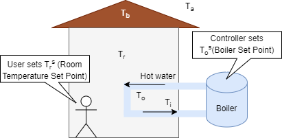
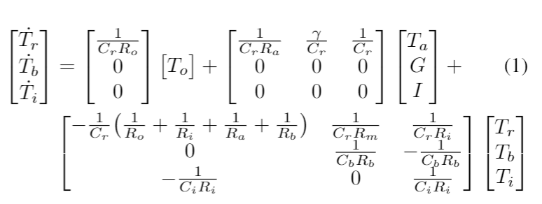
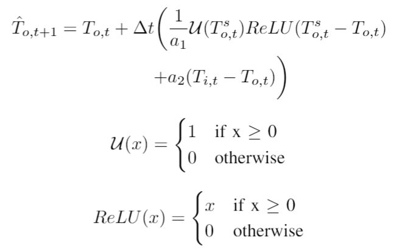
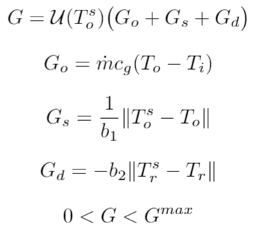
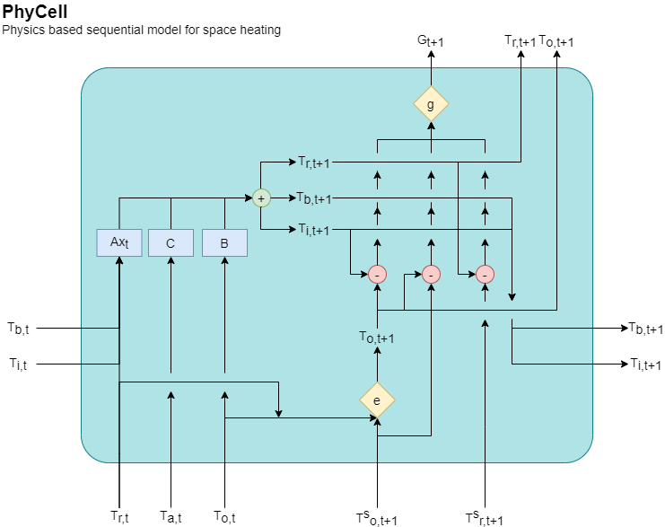

# Reinforcement learning / Module block XXX

# Heating system
Space heating in domestic households can be achieved using water heating systems that can be used for space heating and/orproviding domestic hot water. 
A typical water heating system consists  of  a  radiator and  a  boiler  which  is  used  to  heat  the water.  
Heating  water  circulates  inside  radiator  and  delivers  a heat through surface layer. 
Externally, the radiator is in contact with the air in the room, which is warmed-up. 
Following figure shows a simplified version of the space heating system. Heated water leaves  the boiler  at  boiler  outlet  temperature  (To)  and  cold water  enters  the  boiler  at boiler  inlet  temperature  (Ti).  Theuser requests a room temperature (i.e., Room temperature set point (Trs))

 

## Physical dynamics
### Space Heating - RC Model

Conventionally,  thermal  modelling  the  building  is  done using gray-box models such as an RC network model. 
This models the thermal system using a network of resistances and capacitance and calculates heat flows across different network elements.  
We  define  an  extended  RC  model  for  thermal modeling  that  includes  boiler  outlet  and  boiler  inlet  temperatures.  
Figure below  shows  the  RC  network  for  thermal  modelling. 
This  represents  a  non-linear  system  of  ordinary  differential equations given by Equation below. 
Heat is added into the system by  increasing  the  boiler  outlet  temperature  (To).  
Resistances and  capacitances  are  represented  by R and C respectively. 
The  vector  given  by [Ta,G,I] represents  the  disturbance vector  comprising of  outside  air  temperature,  solar  radiance and  internal  heat  gains.  
Parameter α represents  the  coupling between boiler outlet and boiler inlet temperatures.

 
 

### Boiler outlet temperature

We assume that the boiler temperature depends on boiler set point and boiler inlet temperature. 
A high boiler set will increase the boiler outlet, similarly, a lower room temperature will  make  the  boiler  temperature  decay.  
We  can  estimate  the boiler outlet in the time step *t* + 1 using Following Equations.

### Gas modulation

Gas  modulation  for  by  the boiler  depends  on  the  boiler  configuration.  
We  calculate  gas consumption  using  the equations below,  where  total  gas  consumption depends  on  three  factors,  
namely,  
(i) G o:  the  baseline  consumption  required  to  heat  the  water  from inlet to outlet,  
(ii) G s:which  is  the  startup  consumption,  which  represents  boiler startup  cost  
(iii) G d:  which  is  the  consumption  decay  while running.  
The  second  and  third  terms  are  adjustments  in  the baseline gas consumption.

## Thermal Model

The  thermal  model M of  a  building  has,  
(i)  a  **PhyCell**, which is a sequential model of the dynamic system, and 
(ii) a Dense  network  (**NN**),  used  to  estimate  the  external  disturbances (Ta<\sub>)

### PhyCell 

We introduce a physics cell (**PhyCell**) that implements the dynamics of space heating at each time step *t* and that can be optimized sequentially. 
Figure below provides the architecture of the **PhyCell**.  
The  hidden  parameters  (Ti<\sub> and Tb<\sub> ) are  carried  forward  to  the  next  step  in  the  sequence.

