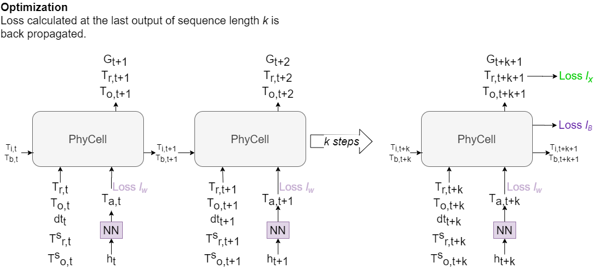
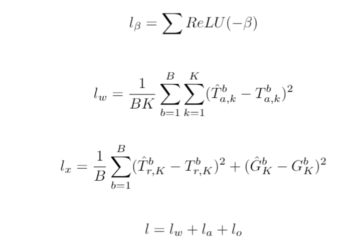
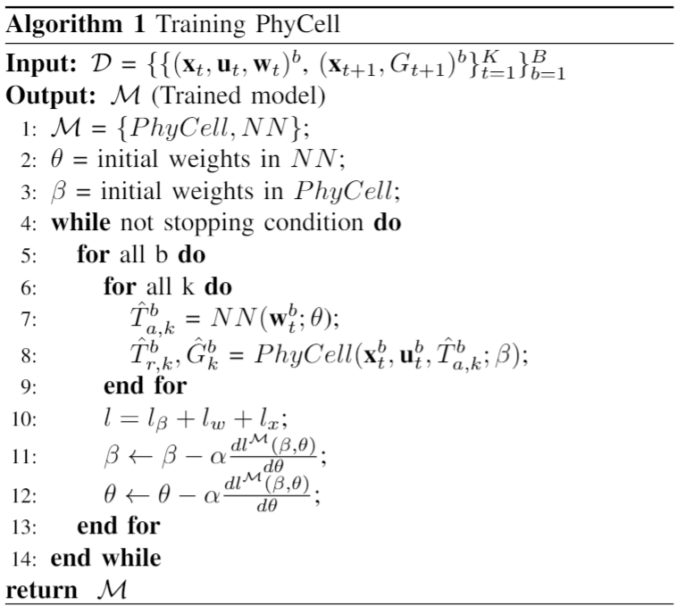
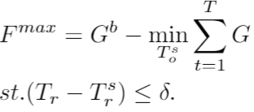

[Return to home](../README.md)

This page provides the detailed overview of the thermal model used for space heating. For details about implementation of related functions please visit [thermal Model](../ReinforcementLearning/ThermalModel.md).

# :card_file_box: Heating system
Space heating in domestic households can be achieved using water heating systems that can be used for space heating and/or providing domestic hot water. 
A typical water heating system consists  of  a  radiator and  a  boiler  which  is  used  to  heat  the water. Heating  water  circulates  inside the radiator  and  delivers  heat through the surface layer. Externally, the radiator surface is in contact with the air in the room, which is warmed up. The figure below shows a simplified version of the space heating system. Heated water leaves  the boiler  at the  boiler  outlet  temperature  (To)  and  cold water  enters  the  boiler  at the boiler  inlet  temperature  (Ti).  The user requests a room temperature (i.e., Room temperature set point (Trs)). The temperature of the building's thermal mass and outside air is given by Tb and Ta respectively.

 

## :round_pushpin: Physical dynamics
### Space Heating - RC Model

 

Conventionally,  thermal  modeling of a  building  is  done using grey box models such as an RC network model. This models the thermal system using a network of resistances and capacitance and calculates heat flows across different network elements. We  define  an  extended  RC  model  for  thermal modeling  that  includes  boiler  outlet  and  boiler  inlet  temperatures.  
The figure above  shows  the  RC  network  for  thermal  modeling. This  represents  a  non-linear  system  of  ordinary  differential equations given by the equation below. Heat is added into the system by  increasing  the  boiler  outlet  temperature  (To). Resistances and  capacitances  are  represented  by R and C respectively.  The  vector  given  by [Ta,G,I] represents  the  disturbance vector,  comprising outside  air  temperature,  solar  radiance and  internal  heat  gains. Parameter α represents the  coupling between boiler outlet and boiler inlet temperatures.

### Boiler outlet temperature

We assume that the boiler temperature depends on the boiler set point and room temperature. A high boiler set point will increase the boiler outlet, similarly, a lower room temperature will  make  the  boiler  temperature  decay. We  can  estimate  the boiler outlet in the time step *t* + 1 using Following Equations.

### Gas modulation

Gas  modulation for the boiler  depends  on  the  boiler  configuration. We  calculate  gas consumption  using  the equations below,  where  the total  gas  consumption depends  on  three  factors, namely,  
(i)&nbsp;Go:  the  baseline  consumption  required  to  heat  the  water from inlet to outlet,  
(ii)&nbsp;Gs: the  startup  consumption cost,  which  represents  boiler startup  cost  
(iii)&nbsp;Gd:  the  consumption  decay  while running.  
The  second  and  third  terms  are  adjustments  in  the baseline gas consumption.

# :card_file_box: Thermal Model

The  thermal  model M of  a  building  has, (i)&nbsp;a  **PhyCell**, which is a sequential model of the dynamic system, and (ii)&nbsp;a Dense  network  (**NN**),  used  to  estimate  the  external  disturbances (Ta)

## :round_pushpin: PhyCell 

We introduce a physics cell (**PhyCell**) that implements the dynamics of space heating at each time step *t* and that can be optimized sequentially. 
The figure below sketches the architecture of the **PhyCell**. The  hidden  parameters  (Ti and Tb) are  carried  forward  to  the  next  step  in  the  sequence.

## Training Algorithm 

We unroll the model in time for *K* steps, i.e., the sequence length, to estimate output and gas consumption for next step. Figure below shows the overview of how data is fed into the unrolled sequential model, and outputs are generated. 

We optimize the PhyCell after passing *K* sequential inputs per batch of size *B*, and back propagating the accumulated loss in the unrolled sequence. Where *l*β is  the  loss  of  the  parameters  (β)  of  PhyCell, that is used to satisfy the constraints. *l*w  is the loss encountered by the neural network in predicting the outside  ambient  temperature.  We  calculate  the  loss  for  each time step for the sequence, where at the *K*th step we calculate the error in room temperature and gas consumption. Estimated  room  temperature  and  gas  consumption are added to calculate *l*x.
We only optimize of gas as room temperature errors because all the other values are optimized by inference.

We  provide  pseudocode  to  train  the  weights  of  the thermal model in Algorithm&nbsp;1 To optimize the parameters of  PhyCell  we  feed  the  data  in  sequences.  Training  data  is divided into *B* sequences of length *K* each. Loss is calculated using the output values and back propagated through time to optimize the parameters.

# :card_file_box: Flexibility

Effective demand response is built on identification and exploitation of flexibility. We make a **thermal model** of a building that can be used to estimate the maximum gas flexibility in the next steps, which can be utilized by the Reinforcement learning based control algorithm. This flexibility can de defined as:

 

Where the gas consumption is minimized for *T* steps based on the boiler output set points Tos. The thermal model will act as a forward model for building a model-based demand response for the building. This thermal model can also be used as the environment class for training the RL agent.

